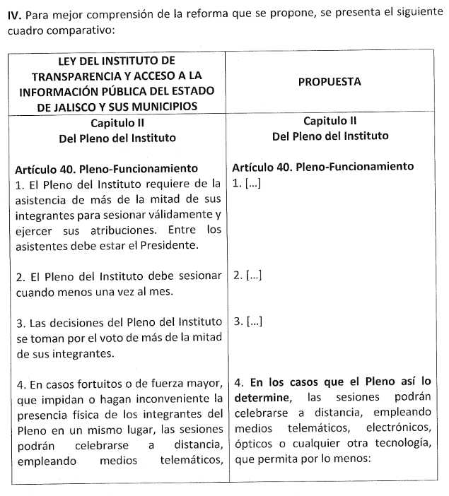
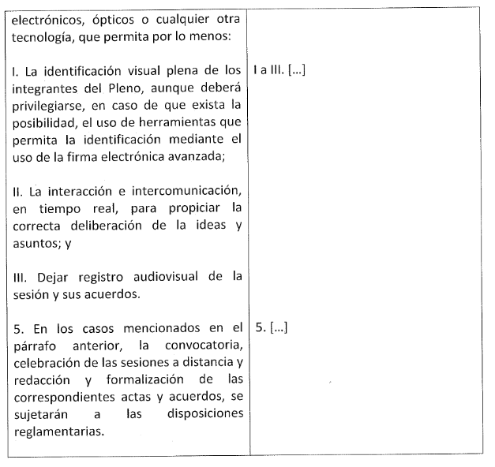
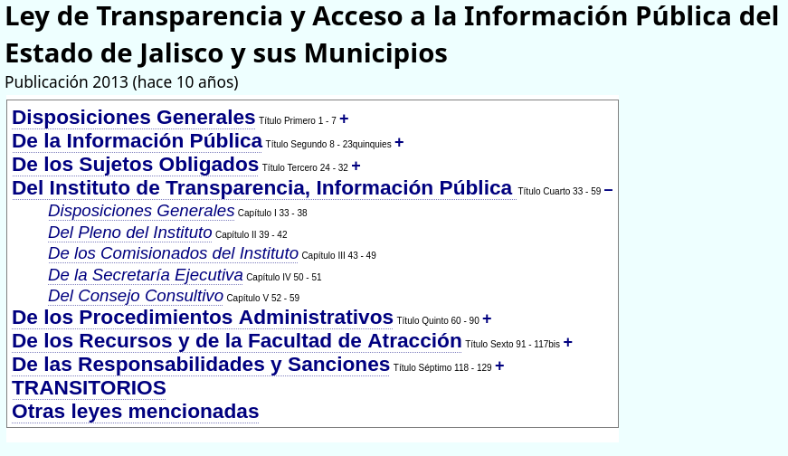
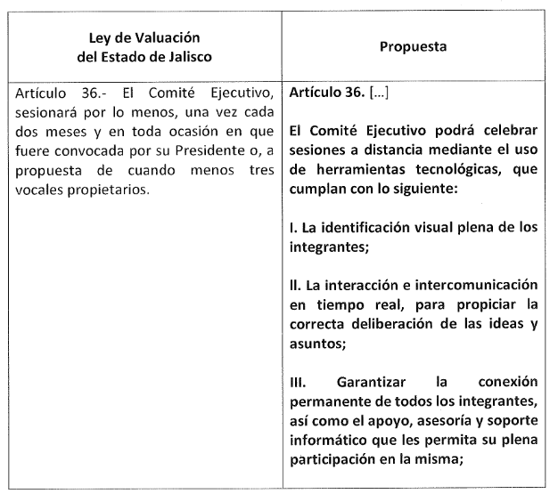
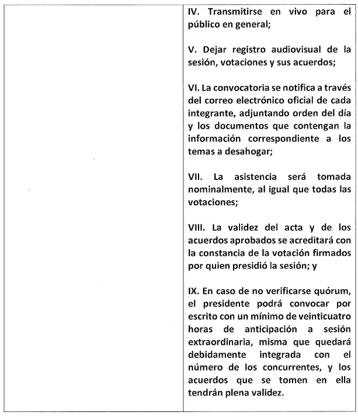
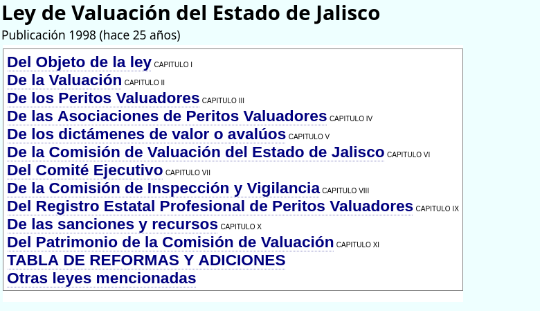

<!--more-->

## Objetivo
Estandarizar los criterios para realizar y evaluar los resúmenes de iniciativas.

**¿Qué se desea comunicar?**
- Qué hace la iniciativa, no qué dice el diputado que presentó la iniciativa.
- Qué hace la iniciativa, no para qué o con qué intención lo hace.

**¿Cómo saber qué hace la iniciativa?**

Necesitamos conocer dos cosas: los cambios y su contexto.
- Los _cambios_ son qué partes cambian de uno o más artículos de una ley.
- El _contexto_ es en qué parte de esa ley están cada uno de los artículos que se modifican y opcionalmente, el tema del artículo.

**Los cambios**

Es necesario conocer el texto *vigente* de cada artículo que se modifica, conocer el texto *modificado* de cada artículo y encontrar la *diferencia* entre el texto vigente y el modificado.

*La tabla comparativa*

Si la tabla comparativa no muestra el artículo vigente completo, falta información. Hay que buscar en [Leyco.org](https://leyco.org) o en internet la ley vigente, localizar el artículo y conocer el texto vigente.

Si la iniciativa no incluye una tabla comparativa, es necesario buscar el texto vigente de cada artículo que se modifica. Después hay que ver en el articulado de la iniciativa cuál es el texto que se modifica para conocer cuáles son los cambios en cada artículo que se modifica.

**El contexto**

Puede servir de base para determinar el tema, porque la parte de la ley donde se realizan los cambios nos da a conocer el aspecto sobre el que trata.

*La descripción del artículo*

En algunas leyes, cada artículo tiene una descripción. La descripción del artículo es una frase que va después de donde dice _Artículo <número>_. La descripción del artículo puede ayudar a determinar el tema.

Ejemplo de un artículo con descripción, en la Ley de Salud del Estado de Jalisco. La descripción se resalta en letra izquierdilla:

Artículo 190 *Profesionales, Técnicos y Auxiliares. Títulos Profesionales para su Ejercicio.*

**¿De qué trata?**

Es una palabra o una frase nominal. Una frase nominal tiene solamente un sujeto, sin el verbo y el predicado como en una oración. El sujeto consta de un sustantivo y un adjetivo y quizás una preposición. A veces van dos o más sustantivos unidos por una conjunción.

El tema no lleva punto al final.
El tema no incluye el para qué ni lo que propone la iniciativa.

*Ejemplos de temas*

Sustantivo: 

  - Infracciones
  - Homicidio
  - Inhabilitación
  - Tabaco
  
Sustantivo y adjetivo: 

  - Derechos humanos
  - Violencia política

Sustantivo y adjetivos: 

  - Personas adultas mayores

Sustantivo, preposición y sustantivo: 

  - Igualdad de género

Sustantivo con adjetivos y conjunción: 

  - Vivienda digna, adecuada y decorosa

Sustantivo, preposición y adjetivo: 

  - Violencia de género
  - Presidente de la CDHJ
  - Robo de autos
  - Sustituto del Síndico en los Ayuntamientos

Varios sustantivos con conjunción: 

  - Pleno, Salas, Comité de Planeación, Consejo de la Judicatura y sus comisiones
  - Derechos de niños y adolescentes
  - Actas de nacimiento y del estado civil
  - Donación y trasplante de órganos, tejidos y células humanas

La lista de los temas que ya están publicados se puede consultar [aquí](https://siguealcongreso.org/temas/).

**¿Qué propone?**

- No incluir mención al artículo o artículos que se modifican ni a la ley a la que pertenecen. Esta información ya está incluida en el campo _Qué cambia_ de la ficha de la iniciativa.
- No incluir frases como *Esta iniciativa propone* o *Propone*.

**Ejemplos de tabla comparativa**

*Con contexto 1230*

*Sin contexto 1234*

